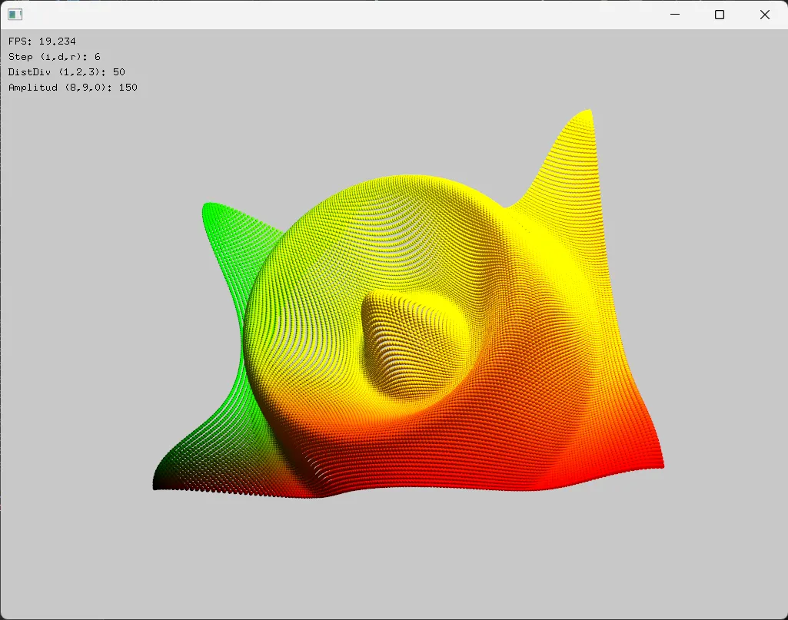

# **Reto**

Vas a desarrollar una aplicación que genere una cuadrícula de esferas en un espacio tridimensional y que permita interactuar con ellas a través de la cámara y el ratón. Deberás implementar la lógica para seleccionar una esfera con el ratón y mostrar la información de la esfera seleccionada en la pantalla.

Por ejemplo, la aplicación podría verse así:

```
#include "ofApp.h"

void ofApp::setup() {
    ofBackground(0);        
    cam.setDistance(600);   // Distancia inicial de la cámara

    gridWidth = ofGetWidth();   // Ancho de ventana
    gridHeight = ofGetHeight(); // Alto de ventana

    generateSpheres(); // Genera las esferas iniciales
}

void ofApp::generateSpheres() {
    spherePositions.clear(); // Limpia lista de esferas

    // Recorre en X e Y para colocar esferas
    for (int x = -gridWidth / 2; x < gridWidth / 2; x += xStep) {
        for (int y = -gridHeight / 2; y < gridHeight / 2; y += yStep) {
            float z = cos(ofDist(x, y, 0, 0) / distDiv) * amplitud; // Fórmula para altura (onda)
            spherePositions.push_back(glm::vec3(x, y, z)); // Guarda posición de cada esfera
        }
    }
}

void ofApp::draw() {
    cam.begin(); // Activa cámara 

    for (auto& pos : spherePositions) {
        // Si la esfera está seleccionada se pinta roja
        if (sphereSelected && glm::distance(pos, selectedSpherePos) < 0.001f) {
            ofSetColor(255, 0, 0);
        }
        else {
            ofSetColor(255); // Esferas normales en blanco
        }
        ofDrawSphere(pos, 5.0); // Dibuja esfera en su posición
    }

    cam.end(); // Desactiva cámara

    // Texto con información en pantalla
    ofSetColor(255);
    ofDrawBitmapString("Step (x,y): " + ofToString(xStep) + ", " + ofToString(yStep), 20, 40);
    ofDrawBitmapString("distDiv: " + ofToString(distDiv), 20, 60);
    ofDrawBitmapString("Amplitud: " + ofToString(amplitud), 20, 80);

    if (sphereSelected) { // Muestra posición de la esfera seleccionada
        ofDrawBitmapString("Esfera seleccionada: ("
            + ofToString(selectedSpherePos.x) + ", "
            + ofToString(selectedSpherePos.y) + ", "
            + ofToString(selectedSpherePos.z) + ")", 20, 100);
    }
}

void ofApp::mousePressed(int x, int y, int button) {
    glm::vec3 rayStart, rayEnd;
    convertMouseToRay(x, y, rayStart, rayEnd); // Convierte click en un rayo

    sphereSelected = false; // Reinicia selección
    for (auto& pos : spherePositions) {
        glm::vec3 intersectionPoint;
        // Comprueba si el rayo golpea una esfera
        if (rayIntersectsSphere(rayStart, rayEnd - rayStart, pos, 5.0, intersectionPoint)) {
            selectedSpherePos = pos; // Guarda la esfera seleccionada
            sphereSelected = true;
            break; // Solo selecciona la primera que encuentre
        }
    }
}

void ofApp::convertMouseToRay(int mouseX, int mouseY, glm::vec3& rayStart, glm::vec3& rayEnd) {
    glm::mat4 modelview = cam.getModelViewMatrix();   // Matriz de vista
    glm::mat4 projection = cam.getProjectionMatrix(); // Matriz de proyección
    ofRectangle viewport = ofGetCurrentViewport();    // Ventana

    // Normaliza coordenadas de ratón [-1,1]
    float x = 2.0f * (mouseX - viewport.x) / viewport.width - 1.0f;
    float y = 1.0f - 2.0f * (mouseY - viewport.y) / viewport.height;

    // Define el rayo en espacio de recorte (NDC)
    glm::vec4 rayStartNDC(x, y, -1.0f, 1.0f);
    glm::vec4 rayEndNDC(x, y, 1.0f, 1.0f);

    // Convierte a coordenadas de mundo
    glm::vec4 rayStartWorld = glm::inverse(projection * modelview) * rayStartNDC;
    glm::vec4 rayEndWorld = glm::inverse(projection * modelview) * rayEndNDC;

    // Divide por w (paso a coordenadas homogéneas)
    rayStartWorld /= rayStartWorld.w;
    rayEndWorld /= rayEndWorld.w;

    // Asigna a variables de salida
    rayStart = glm::vec3(rayStartWorld);
    rayEnd = glm::vec3(rayEndWorld);
}

bool ofApp::rayIntersectsSphere(const glm::vec3& rayStart, const glm::vec3& rayDir,
    const glm::vec3& sphereCenter, float sphereRadius,
    glm::vec3& intersectionPoint) {
    glm::vec3 oc = rayStart - sphereCenter; // Vector desde esfera al rayo

    float a = glm::dot(rayDir, rayDir);       // Coeficiente cuadrático
    float b = 2.0f * glm::dot(oc, rayDir);    // Coeficiente lineal
    float c = glm::dot(oc, oc) - sphereRadius * sphereRadius; // Constante

    float discriminant = b * b - 4 * a * c; // Fórmula cuadrática

    if (discriminant < 0) {
        return false; // No hay intersección
    }
    else {
        float t = (-b - sqrt(discriminant)) / (2.0f * a); // Punto más cercano
        intersectionPoint = rayStart + t * rayDir; // Calcula punto de impacto
        return true;
    }
}

void ofApp::keyPressed(int key) {
    switch (key) {
    case OF_KEY_UP:    // Aumenta amplitud
        amplitud += 10;
        break;
    case OF_KEY_DOWN:  // Reduce amplitud
        amplitud -= 10;
        break;
    case OF_KEY_RIGHT: // Aumenta divisor
        distDiv += 10;
        break;
    case OF_KEY_LEFT:  // Reduce divisor
        distDiv -= 10;
        break;
    case '+': // Incrementa paso entre esferas
        xStep += 5;
        yStep += 5;
        break;
    case '-': // Reduce paso entre esferas (mínimo 5)
        xStep = max(5, xStep - 5);
        yStep = max(5, yStep - 5);
        break;
    }

    generateSpheres(); // Actualizar las esferas despues de presionar la tecla
}
```
```
#pragma once
#include "ofMain.h"

// Clase principal de la app
class ofApp : public ofBaseApp {
public:
    void setup();   // Inicialización
    void draw();    // Dibujo en pantalla
    void keyPressed(int key);              // Eventos de teclado
    void mousePressed(int x, int y, int button); // Eventos de ratón

    // Funciones auxiliares
    void convertMouseToRay(int mouseX, int mouseY, glm::vec3& rayStart, glm::vec3& rayEnd); // Convierte mouse a rayo 3D
    bool rayIntersectsSphere(const glm::vec3& rayStart, const glm::vec3& rayDir,
        const glm::vec3& sphereCenter, float sphereRadius,
        glm::vec3& intersectionPoint); // Comprueba si el rayo choca con una esfera
    void generateSpheres(); // Genera la cuadrícula de esferas

    vector<glm::vec3> spherePositions; // Posiciones de todas las esferas
    ofEasyCam cam;                     // Cámara para movernos en 3D

    // Parámetros ajustables
    int xStep = 50;        // Distancia entre esferas en X
    int yStep = 50;        // Distancia entre esferas en Y
    float distDiv = 100.0; // Controla frecuencia de la onda
    float amplitud = 100.0; // Altura de la onda

    // Variables de control
    int gridWidth, gridHeight;     // Tamaño de la cuadrícula
    glm::vec3 selectedSpherePos;   // Posición de la esfera seleccionada
    bool sphereSelected = false;   // Indica si hay una esfera seleccionada
};
```
<video controls src="Grabación 2025-08-29 163500.mp4" title="Title"></video>

### 1. Investiga: investiga cómo se gestionan los vectores de ofVec3f en C++. ¿Dónde se almacenan? ¿En qué parte de la memoria se guardan los objetos y cómo se gestionan?

Los vectores como ofVec3f (ahora glm::vec3) se guardan en un std::vector, y sus datos se almacenan en el heap. El vector en sí está en el stack, pero sus elementos se guardan de forma contigua en el heap. La memoria se gestiona automáticamente por el vector.

### 2. Experimenta: utiliza el depurador de Visual Studio para examinar la memoria de la aplicación en tiempo de ejecución. Observa en qué parte de la memoria se encuentran los objetos (stack, heap, memoria global).

Usando el depurador, vi que spherePositions está en el stack, pero sus glm::vec3 están en el heap. Las variables simples como xStep o amplitud están en el stack. El contenido dinámico como la cámara también usa el heap internamente.

### 3. Documenta: documenta tus hallazgos en un informe breve, explicando qué descubriste sobre la gestión de la memoria en tu aplicación.

Cuando se presiona una tecla (por ejemplo, las flechas o + / -), se ejecuta la función keyPressed(int key). En esa función se modifican variables como amplitud, distDiv, xStep o yStep, que están almacenadas en el stack porque son variables miembro de la clase ofApp.

Después de cambiar esos valores, se llama a generateSpheres(). Dentro de esa función, primero se llama a spherePositions.clear(), que borra los datos anteriores del heap, y luego se vuelve a llenar el vector con nuevas posiciones (glm::vec3) usando push_back.

Esas nuevas esferas se almacenan en el heap, ya que spherePositions es un std::vector, y sus elementos siempre se almacenan dinámicamente. Cada posición es un glm::vec3, que ocupa 12 bytes (tres floats).

En la función draw(), se recorren las posiciones de las esferas con un bucle for (auto& pos : spherePositions), y se dibujan con ofDrawSphere(). Esas posiciones ya están cargadas en memoria desde el heap.