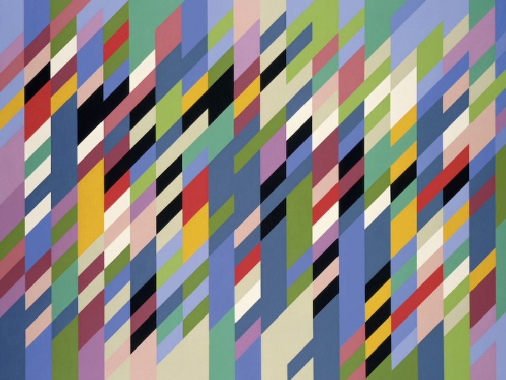

#  ACTIVIDAD 1
## PREGUNTAS

### 1. ¿Qué son los vértices?
Los vértices son puntos que marcan las esquinas o uniones de las figuras 3D. Cada vértice tiene una posición en el espacio y sirve para construir las formas de los objetos. Por ejemplo, si unes tres vértices, formas un triángulo, y con muchos triángulos puedes hacer un modelo 3D completo.

### 2. ¿Con qué figura geométrica se dibuja en 3D?
En 3D todo se dibuja usando triángulos. Los triángulos se usan porque son figuras muy estables y fáciles de calcular. Cualquier forma más compleja se puede dividir en muchos triángulos pequeños para que la computadora pueda procesarla rápido.

### 3. ¿Qué es un shader?
Un shader es un programa pequeño que corre dentro de la tarjeta gráfica (GPU). Se encarga de hacer cálculos especiales, como mover vértices, aplicar luces o dar color a los objetos. Hay distintos tipos de shaders, dependiendo de la parte del dibujo que controlen.

### 4. ¿Cómo se le llaman a los grupos de píxeles de un mismo triángulo?
Se les llama fragmentos. Cada fragmento representa un píxel del triángulo que aparece en la pantalla. Luego, cada fragmento pasa por un proceso para saber su color y si realmente se va a mostrar o no.

### 5. ¿Qué es un fragment shader?
El fragment shader es el programa que decide el color final de cada fragmento o píxel. Ahí se aplican efectos como sombras, luces, reflejos o texturas para que el objeto se vea más realista.

### 6. ¿Qué es un vertex shader?
El vertex shader es el programa que se encarga de procesar los vértices. Toma los puntos del modelo 3D y los transforma para que aparezcan bien ubicados en la pantalla. Básicamente, convierte la posición 3D en una posición 2D visible.

### 7. ¿Al proceso de determinar qué píxeles del display va a cubrir cada triángulo de una mesh se le llama?
Ese proceso se llama rasterización. Ahí la GPU convierte los triángulos en los píxeles o fragmentos que se van a mostrar. Es como pasar de una figura 3D a una imagen 2D formada por píxeles.

### 8. ¿Qué es el render pipeline?
El render pipeline es toda la cadena de pasos que hace la GPU para transformar los modelos 3D en una imagen. Empieza con los vértices, sigue con los triángulos, luego los convierte en píxeles, y al final muestra el resultado en pantalla.

### 9. ¿Hay alguna diferencia entre aplicar un color a una superficie de una mesh o aplicar una textura?
Sí. Si aplicas solo un color, toda la superficie queda igual. En cambio, una textura es una imagen que se pega sobre la superficie y puede tener muchos detalles, como madera, metal o piel. La textura hace que se vea más real.

### 10. ¿Cuál es la diferencia entre una textura y un material?
La textura es solo una imagen, mientras que el material combina varias cosas como el color, la rugosidad, la reflexión, etc. Un material usa texturas para definir cómo se ve una superficie según la luz o el ángulo de la cámara.

### 11. ¿Qué transformaciones se requieren para mover un vértice del 3D world al View Screen?
Primero se hace la transformación del mundo (World Transform), que coloca el objeto en su posición dentro del escenario. Luego viene la vista (View Transform), que es como mover la cámara para ver desde cierto ángulo. Y por último está la proyección (Projection Transform), que convierte todo a una vista 2D para mostrarlo en la pantalla.

### 12. ¿Al proceso de convertir los triángulos en fragmentos se le llama?
Ese proceso también se llama rasterización. Es el paso donde los triángulos se transforman en fragmentos o píxeles que luego se pintan con color o textura.

### 13. ¿Qué es el framebuffer?
El framebuffer es una parte de la memoria donde la GPU guarda la imagen final antes de mostrarla. Es como un borrador donde se van acumulando los colores de cada píxel y al final se envía todo junto al monitor.

### 14. ¿Para qué se usa el Z-buffer o depth buffer en el render pipeline?
El Z-buffer se usa para saber qué objeto está más cerca de la cámara. Cuando dos triángulos se cruzan, el Z-buffer compara sus profundidades y muestra solo el que está al frente, evitando que los del fondo se vean por encima.

### 15. ¿Por qué la GPU tiene que funcionar tan rápido y de manera paralela?
Porque en una escena 3D hay millones de vértices y píxeles que se calculan al mismo tiempo. Si la GPU trabajara como la CPU (uno por uno), tardaría muchísimo. En cambio, la GPU puede procesar miles de fragmentos y vértices al mismo tiempo, lo que permite que los juegos y animaciones se vean fluidos y en tiempo real.


# ACTIVIDAD 2
## EJEMPLOS
## Ejemplo 1:


### ¿Cómo funciona? 
Cuando se dibuja, el shader toma el control y le aplica un gradiente de color que va del celeste y azul al magenta.

### ¿Qué resultados obtuviste? 
Obtuve una pantalla llena con un degradado de colores como azules a morado.

### ¿Estás usando un vertex shader? 
Si, para calcular la posicion de las esquinas del rectangulo.

### ¿Estás usando un fragment shader?
Si, para decidir el color de cada punto de la pantalla, creando el degradado.

### Analiza el código de los shaders. ¿Qué hace cada uno?

Vertex Shader: Coloca el rectangulo para que llene la pantalla.

Fragment Shader: Pinta un degradado que cambia el color según la posicion.

## Ejemplo 2:


### ¿Cómo funciona? 
Dibuja un plano 3D con una malla azul que se deforma como una ola. El shader controla la forma y puede cambiar el color o giro con el mouse.

### ¿Qué resultados obtuviste? 
El plano se veía ondulado y hecho de líneas azules, como si fuera una tela moviendose.

### ¿Estás usando un vertex shader? 
Si, es el que deforma el plano 3D para que se vea como una onda.

### ¿Estás usando un fragment shader? 
Si, es el que pone el color azul a las líneas de la malla.

### Analiza el código de los shaders. ¿Qué hace cada uno?

Vertex Shader: Mueve los puntos para crear la forma ondulada en 3D.

Fragment Shader: Pinta los píxeles de color azul para la malla.
## Ejemplo 3:


### ¿Cómo funciona?
Muestra un plano grande con una malla morada. El shader crea un efecto de "burbuja" o distorsión circular en la malla que sigue al mouse.

### ¿Qué resultados obtuviste? 
Se veía una malla morada cuadriculada, y en el centro, los puntos se separaban y distorsionaban en forma de círculo.

### ¿Estás usando un vertex shader? 
Sí, para deformar la malla y hacer el efecto de burbuja.

### ¿Estás usando un fragment shader? 
Sí, para pintar la malla de color morado.

### Analiza el código de los shaders. ¿Qué hace cada uno?

Vertex Shader: Usa la posición del mouse para mover los puntos y deformar la malla.

Fragment Shader: Pone el color morado a los píxeles de la malla.
## Ejemplo 4:


### ¿Cómo funciona?
Carga una imagen de franjas de colores sobre un plano. El shader permite que el plano (y la imagen) se muevan o se desplacen cuando mueves el mouse.

### ¿Qué resultados obtuviste? 
Vi una imagen de muchas rayas de colores. Al mover el mouse, la textura se desplazaba sobre el plano.

### ¿Estás usando un vertex shader? 
Sí, para mover la posición del plano y ajustar la imagen con el mouse.

### ¿Estás usando un fragment shader?
Sí, para aplicar la textura de franjas de colores a la pantalla.

### Analiza el código de los shaders. ¿Qué hace cada uno?

Vertex Shader: Controla la posición y el movimiento de la imagen.

Fragment Shader: Pinta la textura de colores en el área del plano.
## Ejemplo 5:


### ¿Cómo funciona? 
Utiliza dos imágenes: la de franjas de colores y una máscara blanca circular. El shader las mezcla, y la imagen principal solo se ve en la zona blanca de la máscara, creando un borde suave y redondo.

### ¿Qué resultados obtuviste?
La imagen de franjas de colores solo se veía en un círculo en el centro, con los bordes que se desvanecían a blanco o transparente.

### ¿Estás usando un vertex shader?
Sí, para colocar bien las dos imágenes para la mezcla.

### ¿Estás usando un fragment shader?
Sí, es el que combina la imagen de colores con la máscara para hacer el efecto de desvanecimiento circular.

### Analiza el código de los shaders. ¿Qué hace cada uno?

Vertex Shader: Se asegura de la alineación de las imágenes.

Fragment Shader: Usa la máscara para recortar la imagen de colores con un borde difuminado.
## Ejemplo 6: 


### ¿Cómo funciona?
El programa mezcla tres fuentes visuales (un video, camara y una "textura") usando un shader. La mascara que uno mueve con el mouse decide cual de las tres se ve en un recuadro.
### ¿Qué resultados obtuviste?
Pude ver el video corriendo, la imagen estatica y la textura de prueba, pero solo una era visible a la vez en el recuadro, cambiando con la posicion del mouse que controlaba la mascara.
### ¿Estás usando un vertex shader?
Si, se usa un vertex shader para manejar la posicion y el tamano de las formas que contienen el video, la imagen y la textura de prueba en la pantalla.
### ¿Estás usando un fragment shader?
Si, se usa un fragment shader porque el es el que hace la mezcla de los colores de las tres fuentes (video, imagen, textura de prueba) segun las reglas de la mascara.
### Analiza el código de los shaders. ¿Qué hace cada uno?
Vertex Shader: Se encarga de la geometria. Prepara la forma del recuadro para que las tres texturas se dibujen en el lugar correcto.

Fragment Shader: Se encarga del color y la mezcla. Decide que color final poner en cada pixel al comparar el video, la imagen y la textura de prueba, y solo muestra la textura que la mascara le permite ver.
## Ejemplo 7:


### ¿Cómo funciona?
Permite dibujar en la pantalla. Lo dibujado actúa como una máscara. Un shader mezcla texturas de fondo (como la de papel y líneas) y solo se ven dentro de lo que dibujaste.

### ¿Qué resultados obtuviste?
Después de usar T: Al dibujar las letras 'O' y 'F', solo dentro de esas letras se veía una textura de papel rayado, rodeada de un contorno brillante.

### ¿Estás usando un vertex shader?
Sí, para ordenar y colocar la imagen de fondo y el área de dibujo.

### ¿Estás usando un fragment shader?
Sí, es el que mezcla la textura de las letras (la máscara) con la textura de fondo de papel.

### Analiza el código de los shaders. ¿Qué hace cada uno?

Vertex Shader: Prepara la forma de las texturas en la pantalla.

Fragment Shader: Usa el dibujo (la máscara) para mostrar una textura e ocultar la otra, creando el efecto de "ventana".
## Ejemplo 8:


### ¿Cómo funciona?
Crea una textura de ruido blanco y negro (estática) que cambia. Esta textura se aplica a un plano 3D ondulado que se mueve. El mouse puede controlar el movimiento o giro.

### ¿Qué resultados obtuviste?
Se veía una superficie montañosa con una textura de malla gris y ruido. La forma ondulada estaba moviéndose constantemente.

### ¿Estás usando un vertex shader?
Sí, para crear la forma montañosa y el movimiento de los puntos del plano.

### ¿Estás usando un fragment shader?
Sí, para aplicar la textura de ruido blanco y negro a la superficie del plano.

### Analiza el código de los shaders. ¿Qué hace cada uno?

Vertex Shader: Modifica la posición de los puntos para crear las ondas y picos 3D.

Fragment Shader: Pinta los píxeles con la textura ruidosa que cambia con el tiempo.
## Ejemplo 9:


### ¿Cómo funciona?
Aplica un desenfoque a la imagen de franjas de colores. Usa dos shaders de fragmento para lograr el blur: uno para lo ancho y otro para lo alto. El mouse controla cuánto se desenfoca.

### ¿Qué resultados obtuviste?
Después de mover el mouse: La imagen de franjas de colores se veía borrosa y difuminada, como si estuviera fuera de foco.

### ¿Estás usando un vertex shader?
Sí, solo para colocar la imagen en su sitio antes del desenfoque.

### ¿Estás usando un fragment shader?
Sí, dos de ellos, para hacer el cálculo de desenfoque real.

### Analiza el código de los shaders. ¿Qué hace cada uno?

shaderBlurX: Difumina los colores en dirección horizontal.

shaderBlurY: Difumina los colores en dirección vertical, completando el efecto borroso.


# ACTIVIDAD 3:
## ¿Qué es un Uniform?
Un Uniform es una variable global en los shaders (el codigo que dibuja). Su valor es siempre el mismo para todos los pixeles y vertices que se dibujan en una escena. Se usa para pasar datos constantes, como colores base, tiempo o la resolucion de la pantalla. 

## Comunicacion App y Shaders
La App es el Emisor: Usa una funcion (shader.setUniform...) para enviar un dato (ej., la posicion del raton) a la memoria de la tarjeta grafica, dandole un nombre.

Los Shaders son los Receptores: El codigo GLSL declara una variable uniform con ese mismo nombre. La tarjeta grafica carga el valor enviado por la App en esa variable.
## MODIFICACIÓN DE CÓDIGO:
Este código es un Fragment Shader que pinta un degradado de colores calidos (Naranja a Amarillo) en la pantalla. Lo logra tomando la posicion del pixel (x, y) y usandola para aumentar el Rojo y el Verde, mientras elimina el Azul, creando el tono calido.
```
OF_GLSL_SHADER_HEADER

out vec4 outputColor;

void main()
{
    // Posición del píxel en pantalla
    float x = gl_FragCoord.x / 1024.0;  
    float y = gl_FragCoord.y / 768.0; 
// Gradiente cálido mezclando la posición X e Y
    float r = 0.5 + 0.5 * x;  // Rojo: alto, aumenta horizontalmente (de 0.5 a 1.0)
    float g = 0.5 + 0.5 * y;  // Verde: alto, aumenta verticalmente (de 0.5 a 1.0, se combina con el rojo para formar amarillo)
    float b = 0.0;            // Azul: cero, eliminando los tonos fríos/morados
    float a = 1.0;
 outputColor = vec4(r, g, b, a);
}
```
# ACTIVIDAD 4:
## ¿Qué hace el código del ejemplo?
El codigo muestra una imagen que muevo y desplazo al mover el mouse. Basicamente, uso shaders para que la imagen reaccione en tiempo real al cursor, logrando un efecto visual interactivo.
## ¿Cómo funciona el código de aplicación, los shaders y cómo se comunican estos?
El programa C++ carga la imagen y envia la posicion del mouse a los shaders mediante variables uniform. El vertex shader usa esa posicion para cambiar las coordenadas de la textura y el fragment shader pinta el color final.
## MODIFICACIONES:
En el archivo ofApp.cpp se decidio que el programa enviaria un numero llamado "numero de segmentos" al shader. Este numero es el que define la simetria y cuantas veces se debe repetir el patron de la imagen alrededor del centro, como si fueran varios espejos colocados en circulo.

La creacion de la simetria visual sucede en el Fragment Shader. El codigo toma la ubicacion de cada punto de la imagen y la cambia a un formato de angulo y distancia desde el centro. Despues, esa informacion de angulo se modifica con formulas para que la imagen se repita y se refleje segun el numero de segmentos, creando asi el patron circular del caleidoscopio..jpg>) 

```
 vec2 centerOffset = vec2(0.0, 0.0);
    pos -= centerOffset;
    pos *= zoomFactor;

    float r = length(pos);
    float a = atan(pos.y, pos.x);

    float segmentAngle = 2.0 * PI / numSegments;
    a = mod(a + angleOffset, 2.0 * PI);
    a = abs(a - segmentAngle * floor(a / segmentAngle + 0.5));
    a = abs(a - segmentAngle * 0.5);

    vec2 finalTexCoord = vec2(r * cos(a), r * sin(a));

    finalTexCoord = finalTexCoord + 0.5;

    vec4 textureColor = texture(tex0, finalTexCoord);
