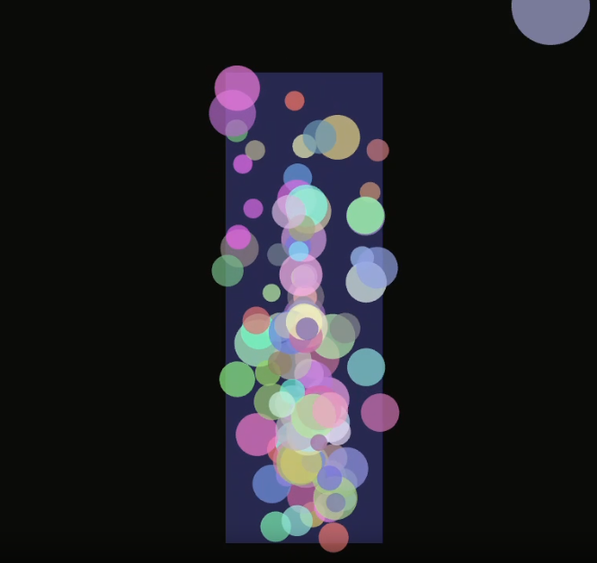

# RETO
## IDEA:
* Quiero hacer una lámpara de lava digital en la que yo pueda interactuar. La idea es que cuando dé click con el mouse se creen burbujas dentro de la lámpara y empiecen a moverse. También quiero que al usar la ruedita del mouse la lámpara se agite y las burbujas se muevan más rápido. Así puedo simular de forma sencilla cómo funciona una lámpara de lava, pero de manera digital.

- Muestra de la idea (faltan correciones)

### ¿Cómo puedo usar herencia en este reto?

En mi proyecto puedo usar herencia creando una clase principal que sea como una partícula general, con cosas basicas como la posicion, el tamaño y la velocidad. Luego puedo hacer que de esa clase salgan otras como la burbuja, y así no tengo que repetir código porque todas heredan lo básico.

### ¿Cómo puedo usar encapsulamiento en este reto?

El encapsulamiento lo aplico cuando pongo los atributos de mis clases en privado y hago funciones para cambiarlos o verlos. De esa forma controlo que nadie modifique mal las variables, por ejemplo la posicion o la velocidad de una burbuja, y asi todo se mantiene más ordenado.

### ¿Cómo aplicar lo visto de rendimiento en este reto?

En cuanto al rendimiento, tengo dos opciones. Si hago que el codigo sea más eficiente, por ejemplo usando vectores y actualizando solo lo necesario, el programa corre mejor y no se pone lento aunque se creen muchas burbujas en la lampara. La otra opcion es limitar el número de burbujas para que no se sobrecargue la memoria.